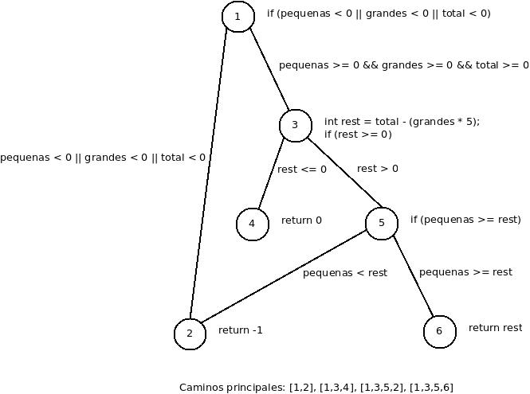
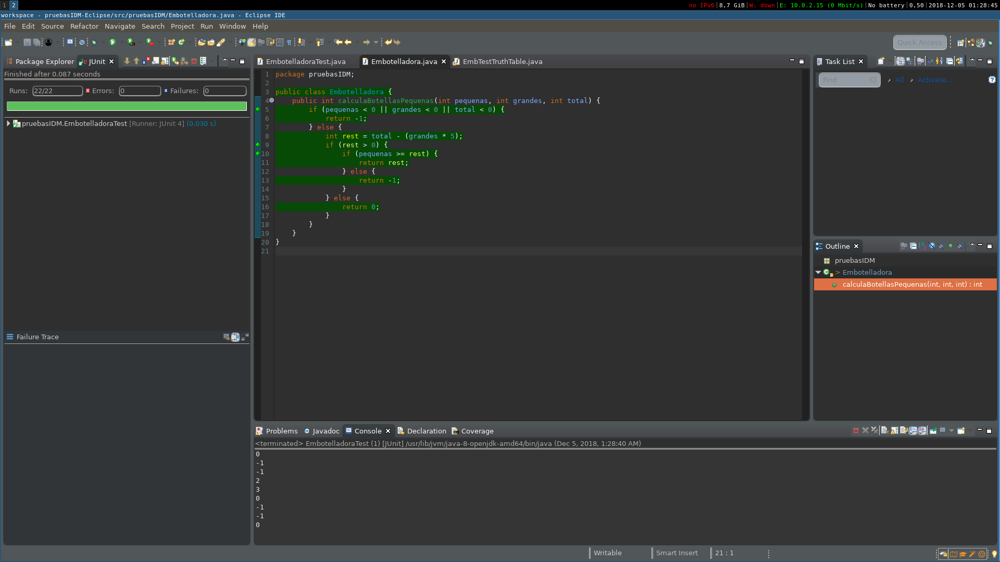

***
# 3. Embotelladora
***
## Parte 1
***

Si el resto es mayor al nº botellas pequeñas (es decir, no hay botellas suficientes) return -1.

### 2. Parámetros: 
	
[int pequenas, int grandes, int total]

### 3. Caracterización:
	
* C1: pequeñas = 0
* C2: grandes = 0
* C3: total = 0
* C4: pequeñas positivo
* C5: grandes positivo
* C6: total positivo
* C7: total < grandes x 5 + pequeñas
* C8: total = grandes x 5 + pequeñas

Dividimos en cero y positivos porque es caso frontera.

### 4. Requisitos:

Vamos a utilizar el criterio MBCC (Multiple Base Choice Coverage).

* Requisitos no posibles:

	O = T OR F
		
	* Entrada 0 y positiva a la vez.
		TOO | TOO | OO
		-|-|-
		OTO | OTO | OO
		OOT | OOT | OO

	* Total mayor e igual a la vez.
		OOO | OOO | TT
		-|-|-

	* Entrada 0 y total != grandes x 5 + pequeñas.
		TTT | FFF | TF
		-|-|-	
		TTT | FFF | FF

	* Total negativo mayor o igual a numeros positivos y/o nulos.
		TTF | FFF | FF
		-|-|-
		TTF | FFF | FT
		FFF | TTF | FF
		FFF | TTF | FT
		TFF | FTF | FF
		TFF | FTF | FT
		FTF | TFF | FF
		FTF | TFF | FT
	
	* Pequeñas + grandes > 0, total 0 y total >= grandes x 5 + pequeñas.
		FTT | TFF | FO
		-|-|-
		TFT | FTF | FO
		FFT | TTF | FO
		
	* Pequeñas + grandes < 0, total 0 y total <= grandes x 5 + pequeñas.
		FFT | FFF | TF
		-|-|-
		TFT | FFF | TF
		FTT | FFF | TF
		FFT | FFF | FT
		TFT | FFF | FT
		FTT | FFF | FT

* #### Bases:
	* Happy path: valores positivos y total < grandes x 5 + pequeñas.
		FFF | TTT | TF
		-|-|-
		FFF | TTF | TF
		FFF | TFT | TF
		FFF | FTT | TF

	* Happy path: valores positivos y total = grandes x 5 + pequeñas.
		FFF | TTT | FT
		-|-|-
		FFF | TFT | FT
		FFF | FTT | FT

	* Happy path: valores positivos y total > grandes x 5 + pequeñas.
		FFF | TTT | FF
		-|-|-
		FFF | TFT | FF
		FFF | FTT | FF

	* Happy path: Pequeñas = 0, total y grandes > 0 y total > grandes x 5 + pequeñas.
		TFF | FTT | FF
		-|-|-
		TFF | FFT | FF
		TFF | FTT | TF
		TFF | FTT | FT

	* Happy path: Grandes = 0, total y pequeñas > 0 y total > grandes x 5 + pequeñas.
		FTF | TFT | FF
		-|-|-
		FTF | FFT | FF
		FTF | TFT | TF
		FTF | TFT | FT

	* Happy path: Total = 0, grandes y pequeñas > 0 y total < grandes x 5 + pequeñas.
		FFT | TTF | TF
		-|-|-
		FFT | FTF | TF
		FFT | TFF | TF

	* Entrada mas simple: todo ceros.
		TTT | FFF | FT
		-|-|-

***
## Parte 2
***

### 2. Pruebas de caja blanca usando grafos:

#### 1.

*  

#### 2.

Caminos principales: [1,2], [1,3,4], [1,3,5,2], [1,3,5,6]

#### 3.

En general los caminos están cubiertos por mas de un test.

* [1,2]: Test 1.
* [1,3,4]: Test 10.
* [1,3,5,2]: Test 7.
* [1,3,5,6]: Test 10.

### 3. Análisis de cobertura en Eclipse:

#### 3. Embotelladora:

